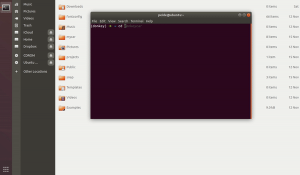
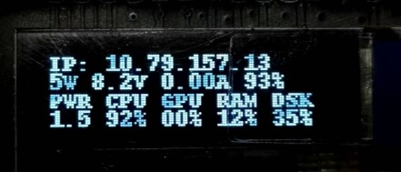
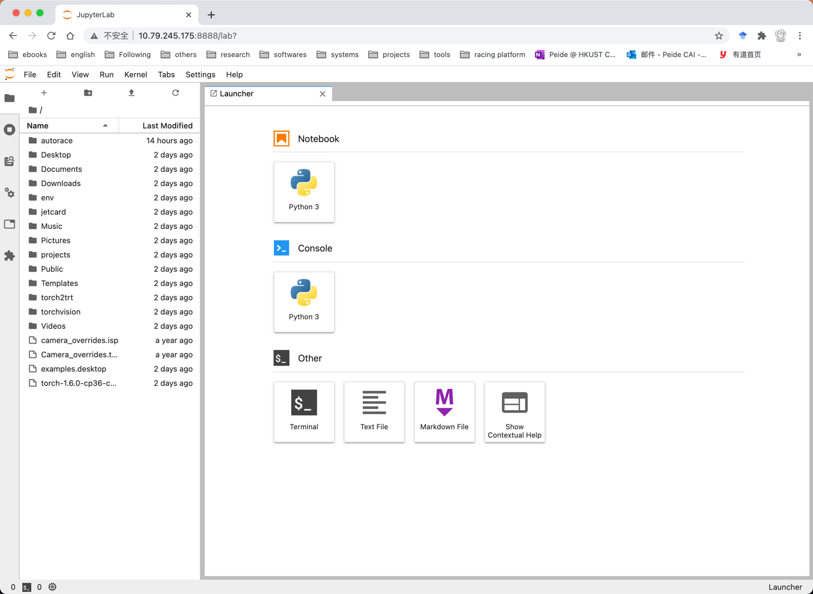

# JetCard

JetCard is a system configuration that makes it easy to get started with AI on Jetson Nano. This repository is built to support the [Autorace project](https://github.com/caipeide/autorace) with application on *autonomous RC-Car racing competitoin*. 

Matainers: [Peide Cai](https://www.ram-lab.com/people/#mr-peide-cai) &lt;pcaiaa@connect.ust.hk&gt;

## Features
JetCard comes pre-loaded with:

* A Jupyter Lab server that starts on boot for easy web programming
* A script to display the Jetson Nano's IP address, CPU & GPU usage, battery life, charging status, etc.
* The popular deep learning frameworks [PyTorch](https://pytorch.org/) (version: 1.6)
* A library to drive RC-Cars [Donkeycar](https://github.com/caipeide/donkeycar)

After configuring your system using JetCard, you can get started prototyping AI projects from your web browser in Python3.

## Setup

After you install [JetPack 4.4](https://developer.nvidia.com/jetpack-sdk-44-archive) on the SD card, boot the system (Ubuntu 18.04) and open a terminal by typing `Ctrl+Alt+T`, and then do the followings to use JetCard to quickly configure your system:

```console
$ cd ~
$ git clone https://github.com/caipeide/jetcard
$ cd jetcard
$ sh ./install.sh <password>
```


The whole installation will cost about 40 min. After that the script will ask you to reboot. Take a look at the ip address shown on the display (10.79.157.13 in this case).



Now you can open a browser on your own laptop and enter `10.79.157.13:8888` for remote connection to and development on the car. (the `<password>` you set earlier will be asked to enter the jupyterlab)



## Credits
1. https://github.com/NVIDIA-AI-IOT/jetcard/tree/jetpack_4.4
2. https://github.com/waveshare/jetcard